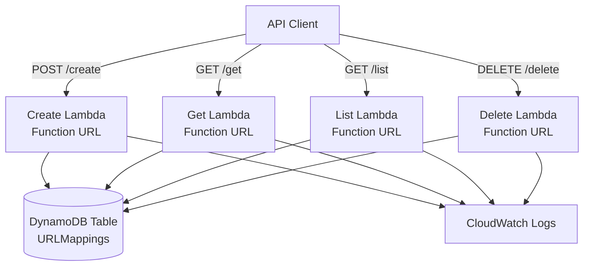

# Design Document

## Overview

The URL Shortener API is a serverless proof-of-concept application built on AWS using Python and SAM (Serverless Application Model). The system provides a RESTful API for creating, retrieving, listing, and deleting URL mappings between long URLs and 6-character alphanumeric short codes. The architecture leverages AWS Lambda with Function URLs for compute, DynamoDB for storage, and CloudWatch for logging and monitoring.

## Architecture

### High-Level Architecture



### Technology Stack

- **Language**: Python 3.13
- **Infrastructure as Code**: AWS SAM (Serverless Application Model)
- **Compute**: AWS Lambda with Function URLs
- **Storage**: Amazon DynamoDB
- **Logging**: Amazon CloudWatch Logs
- **Deployment**: SAM CLI
- **Testing**: pytest with boto3 mocking (75% minimum coverage)

### Design Decisions

1. **Lambda Function URLs over API Gateway**: Simplified architecture for proof of concept, reducing complexity and cost while providing public HTTPS endpoints (YAGNI principle)
2. **Separate Lambda functions per operation**: Clear separation of concerns, easier to maintain and scale independently
3. **DynamoDB single-table design**: Cost-effective and performant for the scale of this POC
4. **No authentication**: Public access for proof of concept simplicity
5. **6-character alphanumeric codes**: Provides 56.8 billion possible combinations (62^6), sufficient for POC scale
6. **pyenv for Python version management**: Ensures consistent Python 3.13 environment across development
7. **snake_case naming convention**: All variables, functions, and resource names follow Python conventions

## Project Structure

```
.
├── .kiro/                              # Kiro configuration and specs
│   ├── specs/url-shortener-api/        # Spec documents
│   └── steering/                       # AI assistant steering rules
├── .venv/                              # Python virtual environment (Python 3.13)
├── src/                                # Lambda source code
│   ├── create-url/                     # Create URL Lambda
│   │   ├── lambda_function.py          # Main handler
│   │   └── requirements.txt            # Lambda dependencies
│   ├── get-url/                        # Get URL Lambda
│   │   ├── lambda_function.py
│   │   └── requirements.txt
│   ├── list-urls/                      # List URLs Lambda
│   │   ├── lambda_function.py
│   │   └── requirements.txt
│   └── delete-url/                     # Delete URL Lambda
│       ├── lambda_function.py
│       └── requirements.txt
├── tests/                              # Test files
│   ├── test_create_url.py
│   ├── test_get_url.py
│   ├── test_list_urls.py
│   ├── test_delete_url.py
│   └── requirements.txt                # Test dependencies (pytest, pytest-cov, moto)
├── cloudformation/                     # SAM CloudFormation
│   └── template.yaml                   # SAM template
├── .gitignore                          # Git ignore patterns
└── README.md                           # Project documentation
```

## Components and Interfaces

### Lambda Functions

#### 1. Create URL Function
- **Purpose**: Generate short codes and store URL mappings
- **HTTP Method**: POST
- **Request Body**:
```json
{
  "url": "https://example.com/very/long/url"
}
```
- **Response** (201 Created):
```json
{
  "short_code": "abc123",
  "short_url": "https://<function-url>/abc123",
  "original_url": "https://example.com/very/long/url",
  "created_at": "2025-11-16T10:30:00Z"
}
```
- **Error Response** (400 Bad Request):
```json
{
  "error": "Invalid URL format",
  "message": "URL must use HTTP or HTTPS protocol"
}
```

#### 2. Get URL Function
- **Purpose**: Retrieve URL mappings by short code or original URL
- **HTTP Method**: GET
- **Query Parameters**: 
  - `short_code`: The 6-character code (e.g., `?short_code=abc123`)
  - `url`: The original URL (e.g., `?url=https://example.com/...`)
- **Response** (200 OK):
```json
{
  "short_code": "abc123",
  "short_url": "https://<function-url>/abc123",
  "original_url": "https://example.com/very/long/url",
  "created_at": "2025-11-16T10:30:00Z",
  "access_count": 42
}
```
- **Error Response** (404 Not Found):
```json
{
  "error": "Not found",
  "message": "No mapping found for the provided identifier"
}
```

#### 3. List URLs Function
- **Purpose**: Retrieve all URL mappings
- **HTTP Method**: GET
- **Response** (200 OK):
```json
{
  "urls": [
    {
      "short_code": "abc123",
      "short_url": "https://<function-url>/abc123",
      "original_url": "https://example.com/very/long/url",
      "created_at": "2025-11-16T10:30:00Z",
      "access_count": 42
    }
  ],
  "count": 1
}
```

#### 4. Delete URL Function
- **Purpose**: Remove URL mappings by original URL
- **HTTP Method**: DELETE
- **Query Parameters**: `url` (the original URL to delete)
- **Response** (200 OK):
```json
{
  "message": "URL mapping deleted successfully",
  "short_code": "abc123",
  "original_url": "https://example.com/very/long/url"
}
```
- **Error Response** (404 Not Found):
```json
{
  "error": "Not found",
  "message": "No mapping found for the provided URL"
}
```

### Shared Components

#### URL Validator Module
- Validates URL format (HTTP/HTTPS only)
- Checks URL structure and protocol
- Returns validation errors with descriptive messages

#### Short Code Generator Module
- Generates random 6-character alphanumeric codes
- Uses characters: a-z, A-Z, 0-9 (62 possible characters)
- Implements collision detection and retry logic
- Maximum retry attempts: 5

#### DynamoDB Client Module
- Abstracts DynamoDB operations
- Handles connection management
- Implements error handling and retries
- Provides consistent interface for all Lambda functions

#### Logger Module
- Structured logging to CloudWatch
- Includes request context (timestamp, operation, identifiers)
- Configurable log levels
- Consistent log format across all functions

## Data Models

### DynamoDB Table: URLMappings

**Table Structure**:
- **Table Name**: `URLMappings`
- **Partition Key**: `short_code` (String)
- **Global Secondary Index**: `OriginalURLIndex`
  - **Partition Key**: `original_url` (String)

**Item Schema**:
```json
{
  "short_code": "abc123",
  "original_url": "https://example.com/very/long/url",
  "created_at": "2025-11-16T10:30:00Z",
  "access_count": 42,
  "ttl": 1735689000
}
```

**Attributes**:
- `short_code` (String, Required): The unique 6-character identifier
- `original_url` (String, Required): The full URL to be shortened
- `created_at` (String, Required): ISO 8601 timestamp of creation
- `access_count` (Number, Required): Number of times the mapping has been retrieved
- `ttl` (Number, Optional): Unix timestamp for automatic item expiration (not implemented in POC)

**Access Patterns**:
1. Get by short code: Query using partition key
2. Get by original URL: Query using GSI
3. Check if URL exists: Query using GSI
4. List all URLs: Scan operation
5. Delete by original URL: Query GSI, then delete by short code

## Error Handling

### Error Categories

1. **Client Errors (4xx)**:
   - 400 Bad Request: Invalid URL format, missing required fields
   - 404 Not Found: Short code or URL not found in database
   - 409 Conflict: Duplicate short code generation failure after retries

2. **Server Errors (5xx)**:
   - 500 Internal Server Error: Unexpected errors, code exceptions
   - 503 Service Unavailable: DynamoDB unavailable or throttled

### Error Response Format

All errors return consistent JSON structure:
```json
{
  "error": "Error category",
  "message": "Detailed error description",
  "request_id": "lambda-request-id"
}
```

### Retry Logic

- **Short code generation**: Up to 5 retries on collision
- **DynamoDB operations**: AWS SDK default retry with exponential backoff
- **Lambda invocations**: No automatic retry (client responsibility)

### Logging Strategy

- **INFO**: Successful operations, request/response summaries
- **WARNING**: Retry attempts, validation failures
- **ERROR**: DynamoDB errors, unexpected exceptions
- **DEBUG**: Detailed request/response data (disabled in production)

## Testing Strategy

### Unit Testing

**Framework**: pytest with boto3 mocking (no moto library)

**Requirements**:
- Minimum 75% code coverage (measured with pytest-cov)
- All tests must pass before deployment
- Mock boto3 calls rather than using actual AWS resources

**Test Cases**:
1. **URL Validator**:
   - Valid HTTP/HTTPS URLs
   - Invalid protocols (ftp, file, etc.)
   - Malformed URLs
   - Empty or null inputs

2. **Short Code Generator**:
   - Generates 6-character codes
   - Uses only alphanumeric characters
   - Handles collision detection
   - Respects retry limits

3. **DynamoDB Client**:
   - Successful CRUD operations
   - Error handling for missing items
   - Connection error handling
   - Proper data serialization

### Lambda Function Testing

**Scope**: Each Lambda function with mocked boto3 DynamoDB calls

**Test Files**:
- `tests/test_create_url.py`: Create function tests
- `tests/test_get_url.py`: Get function tests
- `tests/test_list_urls.py`: List function tests
- `tests/test_delete_url.py`: Delete function tests

**Test Cases**:
1. **Create Function**:
   - Create new URL mapping
   - Return existing mapping for duplicate URL
   - Handle invalid URL input
   - Verify DynamoDB item creation (mocked)
   - Test collision detection and retry logic
   - Test error scenarios (DynamoDB errors, validation failures)

2. **Get Function**:
   - Retrieve by short_code
   - Retrieve by original_url
   - Handle non-existent identifiers
   - Verify access_count increment (mocked)
   - Test error scenarios (missing parameters, not found, DynamoDB errors)

3. **List Function**:
   - Return all mappings
   - Handle empty table
   - Verify response format
   - Test error scenarios (DynamoDB errors)

4. **Delete Function**:
   - Delete existing mapping
   - Handle non-existent URL
   - Verify DynamoDB item deletion (mocked)
   - Test error scenarios (missing parameter, DynamoDB errors)

### CloudFormation Validation

**Tool**: cfn-lint

**Process**:
- Run cfn-lint on cloudformation/template.yaml after template creation
- Fix all validation errors and warnings
- Ensure template follows AWS best practices

### Manual Testing

**Scope**: End-to-end API testing via curl

**Test Scenarios**:
1. Complete workflow: Create → Get → List → Delete
2. Error scenarios: Invalid inputs, non-existent resources
3. Concurrent requests: Multiple creates, gets
4. Edge cases: Very long URLs, special characters

## Deployment Architecture

### SAM Template Structure

```yaml
AWSTemplateFormatVersion: '2010-09-09'
Transform: AWS::Serverless-2016-10-31

Parameters:
  ProjectName:
    Type: String
    Description: Project name for resource naming
  LogRetentionDays:
    Type: Number
    Description: CloudWatch log retention period in days
  AWSRegion:
    Type: String
    Description: AWS region for deployment
  AWSAccountId:
    Type: String
    Description: AWS account ID

Resources:
  # DynamoDB Table
  # Name: {project_name}-{aws_region}-{aws_account_id}-url-mappings
  URLMappingsTable:
    Type: AWS::DynamoDB::Table
    
  # Lambda Functions (Python 3.13 runtime)
  # Each with dedicated CloudWatch log group
  CreateURLFunction:
    Type: AWS::Serverless::Function
    
  CreateURLLogGroup:
    Type: AWS::Logs::LogGroup
    
  GetURLFunction:
    Type: AWS::Serverless::Function
    
  GetURLLogGroup:
    Type: AWS::Logs::LogGroup
    
  ListURLsFunction:
    Type: AWS::Serverless::Function
    
  ListURLsLogGroup:
    Type: AWS::Logs::LogGroup
    
  DeleteURLFunction:
    Type: AWS::Serverless::Function
    
  DeleteURLLogGroup:
    Type: AWS::Logs::LogGroup

Outputs:
  CreateURLEndpoint:
    Description: Create URL Function URL
    
  GetURLEndpoint:
    Description: Get URL Function URL
    
  ListURLsEndpoint:
    Description: List URLs Function URL
    
  DeleteURLEndpoint:
    Description: Delete URL Function URL
```

### IAM Permissions

Each Lambda function requires:
- `dynamodb:PutItem` (Create function)
- `dynamodb:GetItem` (Get function)
- `dynamodb:Query` (Get, Delete functions)
- `dynamodb:Scan` (List function)
- `dynamodb:DeleteItem` (Delete function)
- `dynamodb:UpdateItem` (Get function for access count)
- `logs:CreateLogGroup`, `logs:CreateLogStream`, `logs:PutLogEvents` (All functions)

### Naming Convention

All AWS resources follow the pattern: `{project_name}-{aws_region}-{aws_account_id}-{resource_name}`

Examples:
- DynamoDB Table: `url-shortener-us-east-1-123456789012-url-mappings`
- Lambda Function: `url-shortener-us-east-1-123456789012-create-url`
- Log Group: `/aws/lambda/url-shortener-us-east-1-123456789012-create-url`

### Environment Variables

Each Lambda function receives:
- `TABLE_NAME`: DynamoDB table name (following naming convention)
- `LOG_LEVEL`: Logging verbosity (INFO, DEBUG, etc.)

## Performance Considerations

### Scalability

- **Lambda concurrency**: Default account limits (1000 concurrent executions)
- **DynamoDB capacity**: On-demand billing mode for automatic scaling
- **Function URLs**: No throttling limits beyond Lambda concurrency

### Latency Targets

- Create operation: < 2 seconds (includes short code generation and DynamoDB write)
- Get operation: < 1 second (single DynamoDB query)
- List operation: < 3 seconds (full table scan)
- Delete operation: < 1 second (GSI query + delete)

### Optimization Strategies

1. **Connection reuse**: Initialize DynamoDB client outside handler for connection pooling
2. **Minimal dependencies**: Keep Lambda package size small for faster cold starts
3. **Efficient queries**: Use partition key and GSI for O(1) lookups
4. **Batch operations**: Not implemented in POC, but could batch list operations for large datasets

## Security Considerations

### Current Implementation (POC)

- **No authentication**: Function URLs are publicly accessible
- **No authorization**: All operations available to all clients
- **No rate limiting**: Relies on AWS Lambda throttling
- **No input sanitization**: Basic URL validation only

### Production Recommendations

- Implement API key authentication
- Add AWS WAF for DDoS protection
- Enable CloudWatch alarms for anomalous activity
- Add request signing for API integrity
- Implement rate limiting per client
- Add input sanitization for XSS prevention
- Enable DynamoDB encryption at rest
- Use VPC endpoints for private access

## Monitoring and Observability

### CloudWatch Metrics

- Lambda invocation count, duration, errors
- DynamoDB read/write capacity units
- Lambda concurrent executions
- Function URL request count

### CloudWatch Logs

- Structured JSON logs from all Lambda functions
- Request/response logging
- Error stack traces
- Performance timing data

### Alarms (Recommended)

- Lambda error rate > 5%
- Lambda duration > 10 seconds
- DynamoDB throttled requests > 0
- Lambda concurrent executions > 800

## Future Enhancements

1. **Custom short codes**: Allow users to specify custom short codes
2. **Expiration**: Implement TTL for automatic URL expiration
3. **Analytics**: Track click-through rates, geographic data
4. **Batch operations**: Create/delete multiple URLs in single request
5. **Caching**: Add CloudFront or ElastiCache for frequently accessed URLs
6. **Authentication**: Add API key or OAuth support
7. **Rate limiting**: Implement per-client rate limits
8. **URL validation**: Check if destination URLs are reachable
